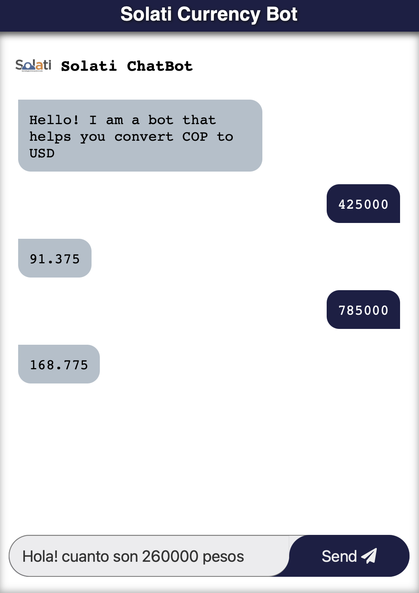

# Solati Currency Converter



## src_server

En este folder se encuentran todos los archivos del servidor.
Para inicializar el servidor ejecuta:
`npm run server`

## src_client

En este folder se encuentran todos los archivos del cliente.
En este caso la ejecucion no es tan sencilla, pues quise implementar el servidor utilizando http pero no logre hacer las configuraciones necesasrias para correrlo con `npm`.

Para inicializar el servidor ejecuta:

```
cd src_client
node index.js
```
